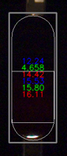
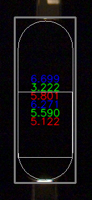
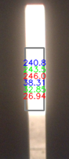

# 胶囊背光检 手工建模 Tutorial

## 1. 前置条件

### 1.1 图片准备

准备以下图片：

- 合格填充胶囊
- 空胶囊
- 无胶囊

以上每种至少一张图片，且所有通道全满/空

### 1.2 正面检建模

背光检建模必须在正面检模板已经建立的情况下进行

（因为需要从模板中得到胶囊在图片中的位置）

### 1.3 软件版本

- aczn-algo >= 3.7.5
- 可用的 inspect-app

## 2. 准备以下flow用于建模

通常起名为 conf_cal-backlight-<?>.yaml，其中 ? 可以是：

- e(Empty): 空胶囊
- f(Filled): 实心胶囊
- n(NA): 无胶囊

```yaml
# conf_cal-backlight-<?>.yaml
init:
  mode: calibrate
  parameter: params0.yaml
  result_yaml: params0-backlight-<?>.yaml
flow:
  commands:
  - load_image:
      image: image
  - intensity_compare:
      src: image
      model_img: result_img
      class: 0 # empty: 0, filled: 1, na: -1
  - save_image:
      image: result_img
      tag: res
```

其中，针对不同的图片类型，需要填写不同的配置

|        | class |
| ------ | ----- |
| Empty  | 0     |
| Filled | 1     |
| NA     | -1    |

此时我们至少拥有了以下文件：

- 正面检模板：params#.yaml
- conf_cal-backlight-e.yaml
- conf_cal-backlight-f.yaml
- conf_cal-backlight-n.yaml

## 3. 建模

### 3.1 分别对每种情况建模

```shell
inspect_app.exe -c .\conf_cal-backlight-e.yaml -i <empty-img-name>.bmp -p .\params#.yaml -r params#-backlight-e.yaml
inspect_app.exe -c .\conf_cal-backlight-f.yaml -i <filled-img-name>.bmp -p .\params#.yaml -r params#-backlight-f.yaml
inspect_app.exe -c .\conf_cal-backlight-n.yaml -i <nan-img-name>.bmp -p .\params#.yaml -r params#-backlight-n.yaml
```

运行后，将会生成 `<imgname>-res.png` ，其中包含建模的可视化结果：

Empty:



Filled:



NA:



图中的数字，从上到下依次为：

- 蓝色平均值
- 绿色平均值
- 红色平均值
- 蓝色标准差
- 绿色标准差
- 红色标准差

### 3.2 模板融合

分别对三张图片进行建模后，我们得到了：

- params#-backlight-e.yaml
- params#-backlight-f.yaml
- params#-backlight-n.yaml

现在我们需要将三个文件合并为一个 params#-backlight.yaml

#### 方法a 手动简单合并

按照字典深度合并的规则，直接手动进行合并

#### 方法b 使用python脚本合并

使用下面的python脚本

```shell
python merge_backlight.py <cam_id>
```

即可合并对应相机的三个文件

```python
# merge_backlight.py
import sys
import ruamel.yaml

yaml = ruamel.yaml.YAML()

if len(sys.argv) < 2:
    print("Usage: python merge_backlight.py <id>")

else:
    i = sys.argv[1]

    result = {'capsule': {}}

    for c in ['e', 'n', 'f']:
        with open(f'params{i}-backlight-{c}.yaml', 'r') as file:
            temp = yaml.load(file)
            result['capsule'] |= temp['capsule']
    
    saved_name = f'params{i}-backlight.yaml'
    
    with open(saved_name, 'w') as fout:
        yaml.dump(result, fout)
        print(f'✅ Merged to {saved_name}')
```

合并完成后，以 e/f/n.yaml 结尾的文件不再需要

### 3.3 对每个相机的图片进行建模

对每个相机的图片，重复 3.1 ~ 3.2 操作

## 4. 进阶设置

> 当遇到比较困难的情况时，可以通过以下配置，达到更好的检测效果

### 4.1 建模时

在 `conf_cal-backlight-[efn].yaml` 的 `intensity_compare` 节点中，加入：

```yaml
just_body: true
directions: [1, 0, 1, 1, 0, 1] # 输入建模图片中胶囊的实际朝向，1：帽在上体在下 0：帽在下体在上
```

增加此设置后，建模时将会额外记录“囊体区域”的RGB分量数值

（囊帽位置是两层壳，囊体位置是一层壳，更易分辨胶囊是否填充有粉）

### 4.2 检测时

在 `conf_inspect-backlight.yaml`的`intensity_compare`节点中，加入：

```yaml
just_body: true
```

增加此设置后，检测时将会只比对“囊体区域”的RGB分量数值，以分辨是否为空胶囊

### 4.3 weights

示例：

观察 3.1 中的两张图，我们会发现：

- 红色和蓝色通道的数值差别较大
- 绿色通道的数值差别较小

此时我们可以配置不同分量的权重，以提高检测效果

在 `params#-backlight.yaml`的`capsule`节点中增加：

```yaml
weights: [1.0, 0.0, 1.0, 0.0, 0.0, 0.0] # B_mean, G_mean, R_mean, B_stddev, G_stddev, R_stddev
```

按此设置以后，我们在进行计算时，**只**计算 **蓝色**分量均值和**红色**分量均值，**屏蔽**了其他分量

如配置得当，将进一步提升检测效果

## 5. 效果测试

> 注意：离线测试和正常跑机的效果可能会不一样！正常跑机时，正面检的最后一次检测，会将胶囊的实时位置发送给后台；背光检时，会从后台接收胶囊的实时位置。当拥有了胶囊的实时位置后，检测将使用更精细的mask，而不是box，结果会更加准确。

此时我们至少需要以下文件：

- params#-backlight.yaml
- detectors0.yaml （可以用空文件，将使用默认值）
- conf_inspect-backlight.yaml （参考如下）

```yaml
# conf_inspect-backlight.yaml
init:
  mode: inspect
  parameter: params0-backlight.yaml
  detectors: detectors0.yaml
  result_yaml: result.yaml
  test_mode: 1
  can_judge_NA: false
flow:
  commands:
  - load_image:
      image: image
  - intensity_compare:
      src: image
      save_defect: 1
      def_img: cap_defect
      INTERNAL_ENGINE_KEY: 0
```

```yaml
# detectors0.yaml
backlight_detector:
  use: 1
  parameters:
    bias:
      val: 0.9 # 0.0 <--倾向于合格--1.0--倾向于空胶囊--> +∞
```

使用以下参数运行 inspect-app

```shell
inspect_app.exe -c .\conf_inspect-backlight.yaml -d .\detectors0.yaml -p .\params#-backlight.yaml -i <test-img>.bmp
```

调参方式详见 “胶囊360调优手册”
