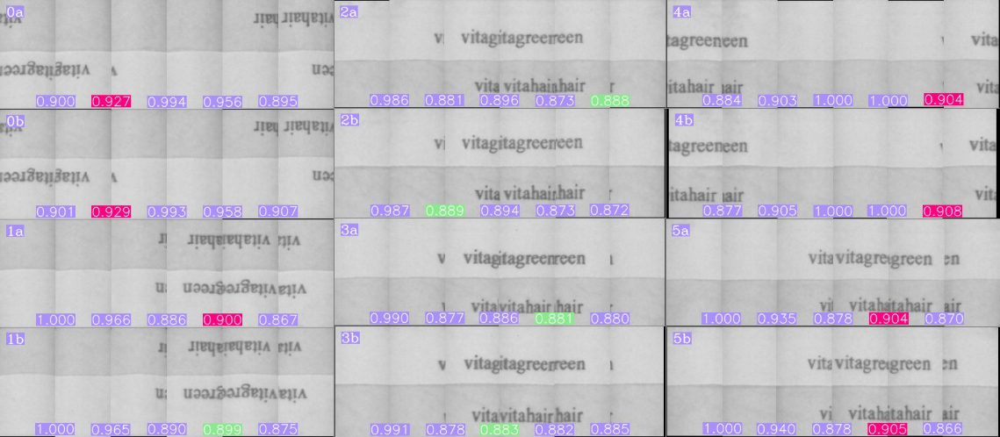
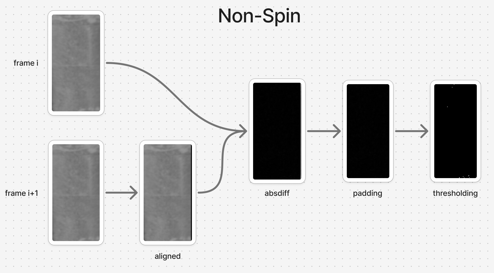
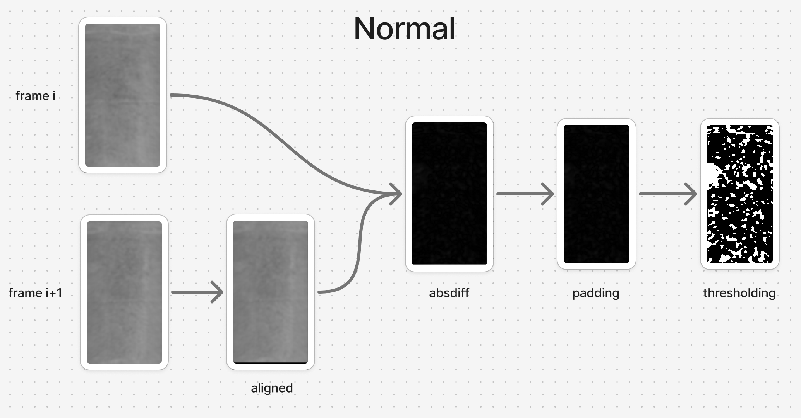
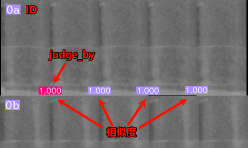

# 胶囊不转检测



## 原理

图片的输入输出：使用字符检逻辑

计算相邻两帧的图像相似度

如果相似度普遍很高，说明胶囊没转

```{新版本算法}
为了能检测无印字/无特征胶囊的不转，首先将相邻帧使用ECC做alignment，再用 absdiff→threshold→统计前景像素占比 的方式代替原来的感知哈希算法
```





## 版本要求

aczn-algo >= 3.9.1

## 用法

```{important}
新算法目前只支持独立使用
```

1. conf_inspect.yaml 需支持字符检
```yaml
# conf_inspect.yaml
    ...

    - capsule_detect:
        ...
        unwrap_src: image_L # 该节点必须存在
        ...
    
    ...
```

2. 打开字符检功能，并使用如下yaml
```yaml
# conf_inspect-printing.yaml
init:
  mode: text_inspect   # 注意要设置为字符检模式
  test_mode: 0
  min_version: 3.9.1
  can_judge_NA: false  # 无胶囊的结果为OK，因此这里需要设为false
flow:
  commands:
    - load_images:
        INTERNAL_ENGINE_KEY: 0
        images: [e0, e1, e2, e3, e4, e5]  # 根据曝光次数变化

    - capsule_similarity:        
        INTERNAL_ENGINE_KEY: 1
        src: [e0, e1, e2, e3, e4, e5] # 根据曝光次数变化
        num: 6                        # 单张图片中的胶囊/通道数量
        work_mode: standalone         # 工作模式 standalone/after_text(暂时不支持)     
        def_src: image_defsrc
        def_img: image_defect
        configs:
          edge_ratio: 0.2             # 取unwrap图片时，两侧截取掉的部分
          expo_times: 6               # 曝光次数
          judge_mode: max             # 工作模式： [max, min, mid, mean]
          h_padding: 3                # 上下的padding像素数量
          w_padding: 6                # 左右的padding像素数量
          threshold: 5                # 二值化阈值
          eps: 0.5                    # 图像对齐的精度
          scale: 0.5                  # downsample的scale
```

3. 如需调参，增加如下选项
```yaml
# detectors0.yaml
capsule_detector:
  use: 1
  parameters:
    similarity_ub:
      val: 0.9     # 相似度上限，超过此值则为NG
```

## 参数详解

### work_mode
- standalone （独立使用模式）
- after_text （接在字符检后面使用，目前尚未开发）

### edge_ratio

```{note}
因为囊体和囊帽的尺寸不同，展开图的两侧会有一些多余的像素。根据edge_ratio将两侧的多余像素截掉
```

默认为0.2，代表两侧各截掉20%的列

### judge_mode

| 模式 | 解释 | 适用场景 |
| --- | --- | --- |
| max | 最大值模式 | 只要有一次不转就算NG |
| min | 最小值模式 | 每次都不转才算NG（只要有一次转就不算NG） |
| mid | 中位数模式 | (默认)总次数的50%以上不转算NG |
| mean | 平均值模式 | 根据总体的平均不转程度 |

### h_padding & w_padding

```{note}
在做图像对齐时，后一张图像可能有一些像素前一张图像中没有，通常出现在边缘。

这些像素会使用0填充，在做相似度比较时会影响结果，因此需要截取掉。
```

单位：像素
默认值：
- h_padding: 3
- w_padding: 6

当发现结果图片中存在误检，且误检主要有黑边较大引起，可适当提高数值。

### threshold

在做过图像对齐之后，会对两帧图像做absdiff，之后再做阈值化。

因此 `相似度 = 1.0 - 像素数量（灰度>threshold）/ 总像素数量`

threshold 用于控制相似度计算的敏感度，数值越低越敏感。

默认值为 5

### eps
```{note}
图像对齐时，迭代运算的终点像素精度。比如eps=0.5，代表两个图像的对齐程度达到0.5个像素后停止。
```

此参数同时影响检测效果和耗时，因此需要权衡

eps越小，对齐的精度越高，耗时也越长

通常，如果eps>=1.0，检测效果会大幅下降

默认为0.5，取值尽量不超过1.0

### scale
```{note}
基于ecc的图像alignment非常耗时，因此在做alignment之前，先将图像降采样，由scale控制。

比如scale=0.5，代表将图片降采样到原始尺寸的0.5倍大小
```

此参数同时影响检测效果和耗时，因此需要权衡

scale越小，降采样之后的图像越小，检测效果越不稳定，耗时也越短

根据之前的测试效果，当scale=0.25时，alignment的结果会变得不可控。

默认为0.5。当scale<=0或>=1.0时，不启用降采样。

### similarity_ub
```{note}
算法会先根据 judge_mode 选出用于裁定的数值，数值>similarity_ub则为NG
```

默认为 0.9

## 缺陷图说明


