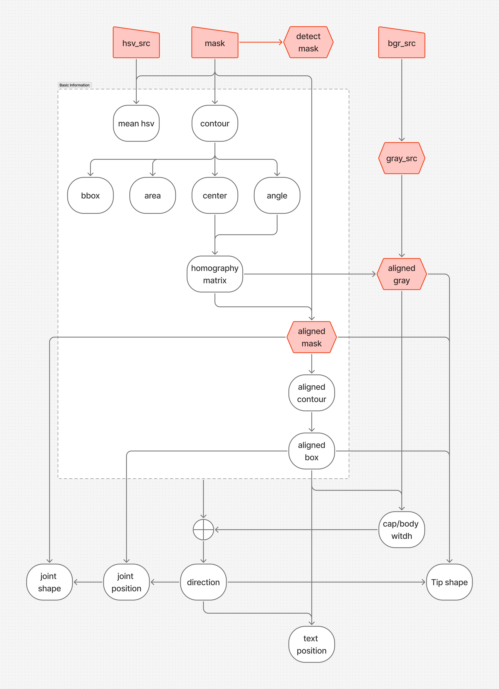
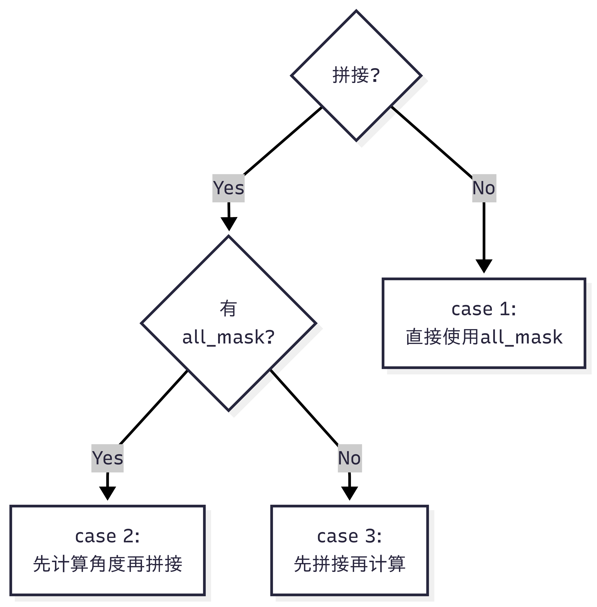

# 胶囊检新算法说明

## 版本要求

aczn-algo >= 3.10.1

## 路线图



## 主要特性

同样的检测能力下：
- CPU占用率降低15%
- 耗时降低50%

更优的检测能力：
- 所有计算提升至亚像素精度
- 所有检测项均有单独的开关，且可分帽/体控制
- 宽度差引入基于梯度计算，双帽检测更准
- 黑点检测，参数配置更灵活
- 并行执行无锁设计

## 参数简述

### conf_inspect.yaml

```yaml
    - capsule_detect_new:
        raw_src: image              # 用于作为crop的原始图像
        bgr_src: image_smooth       # 1. gray图像提取的src 2. blob检测使用特殊colorspace的src
        hsv_src: image_hsv          # 1. gray图像使用V通道时的src 2. blob检测使用HSV时的src 3. 颜色检查的src
        all_mask: capsule_mask      # 1. 生成detect_mask.all的src 2. 判断[有无,多粒,内孔]的src 3. 计算整体的[contour,area,center,bbox,rrect,roi_roi,angle,trans,roi_trans]的src 4. case1情况下用于align的src
        cap_mask: cap_mask          # (双色)需提供 1. 生成detect_mask.cap的src 2. case2下判断cap[有无,多粒,内孔]的src 3. 计算帽的[contour,area,center,bbox,rrect]的src 4. case2下用于拼接整体mask的src
        body_mask: body_mask        # (双色)需提供 1. 生成detect_mask.cap的src 2. case2下判断cap[有无,多粒,内孔]的src 3. 计算帽的[contour,area,center,bbox,rrect]的src 4. case2下用于拼接整体mask的src
        def_src: image              # 用于绘制缺陷图的src
        cropped: [c00, c01, c10, c11, c20, c21, c30, c31, c40, c41, c50, c51] # crop的输出，顺序: 先列后行，size == 通道数x2
        imgsz: [1024, 896]          # 必填项 [宽, 高] 1. 检查输入图像的尺寸 2. 边界检查时的依据 3. 过程图像生成的尺寸
        execution_policy: par       # 执行策略，可选：[par, seq, par_unseq] (并行/顺序/无序并行)
        config:
          valid_lb:
            all: 2000               # 判断胶囊有无的阈值
            cap: 2000               # (双色)判断囊帽有无的阈值
            body: 2000              # (双色)判断囊体有无的阈值
          morphology_concat:        # case 2/3 情况下，对 concat 后的 mask 进行形态学操作的参数
            type: [open, close]
            ksize:
              - [1, 1]
              - [1, 1]
          joint_range:                    # 接缝的相对位置 *1
            upper_negative: [0.47, 0.56]  # 上排帽在下
            lower_positive: [0.43, 0.52]  # 下排帽在上
            lower_negative: [0.38, 0.45]  # 下派帽在下
          text_range:                     # 印字的相对位置 *1
            upper_positive:               # 上排帽在上
              - [0.2, 0.4]                # 当有多行文字时，设置多个范围
            upper_negative:               # 上排帽在下
              - [0.6, 0.8]
            lower_positive:               # 下排帽在上
              - [0.2, 0.4]
            lower_negative:               # 下排帽在下
              - [0.6, 0.8]
        rule:
          mask:
            all_mask:               # 整体mask
              check: true           # 是否检查？
              concat: false         # (双色)是否用帽体拼接？
              concat_ksize: [3, 5]  # (双色)拼接的ksize
            cap_mask:               # (双色)囊帽mask
              check: false          # (双色)是否检查？
            body_mask:              # (双色)囊体mask
              check: false          # (双色)是否检查？
          detect_mask:              # 1. 定义检查的范围 2. 防止all_mask存在覆盖不到的区域
            all:                    # 定义整体detect_mask的生成方式
              type: [convex_hull, open, close]
              ksize:
                - [3, 3]
                - [15, 15]
                - [13, 13]
            cap:                    # (双色)定义囊帽detect_mask的生成方式
              type: [open, close]
              ksize:
                - [13, 13]
                - [13, 13]
            body:                   # (双色)定义囊体detect_mask的生成方式
              type: [open, close]
              ksize:
                - [13, 13]
                - [13, 13]
          width_diff:               # 宽度差计算
            check: true             # 是否检查？(对于单色胶囊，为了判断胶囊朝向，无论是否检查都将计算宽度差)
            method: gradient        # 检查方法 可选：[gradient, meanx] (基于梯度/老算法)
          color:                    # 颜色检查 (可按需开启)
            check_all: false        # 检查整体?
            check_cap: false        # (双色)是否检查囊帽？
            check_body: false       # (双色)是否检查囊体？
          crop:                     # crop的规则 (用于生成给深度推理用的小图)
            policy: disable         # 裁切策略，可选：[disable, na, ng, ok] *2
            margin: 2               # 裁切时多留出的边界
          shape:                    # 形状检查
            align_norm:             # 轮廓插值、对齐，逐像素计算距离的算法（目前性能不好，尚在开发中）
              all: false            # 暂不检查
              cap: false            # (双色)暂不检查
              body: false           # (双色)暂不检查
            hu_moments:             # 基于Hu矩的算法 (虽然很快，但是检测效果一般)
              all: false            # 暂不检查
              cap: false            # (双色)暂不检查
              body: false           # (双色)暂不检查
            fit_ellipse: true       # 端部轮廓椭圆拟合后检查 建议开启
            use_old: true           # 老算法 建议开启
          blob:                     # 斑点检查 建议开启 (需详细修改detectors.yaml)
            check: true             # 是否检查？
          canny:                    # 条纹检查
            check: true             # 是否检查？
            ksize_erode: [9, 5]     # 检查范围的收缩程度 (防止胶囊的边缘被当作edge)
          topconcave:               # 顶凹检查
            check_cap: true         # 检查囊帽端？
            check_body: true        # 检查囊体端？

```

*1 [y_range格式](#yrange-anchor)

*2 [裁切规则](#crop-anchor)

### detectors.yaml

可以直接沿用旧模板，但是黑点检测部分需要修改

```yaml

    blob_detectors:                     # 内容为sequence，可以针对多种不同形态的斑点进行检测
      - colorspace: Lab                 # 支持: [Lab, Luv, HSV, HLS, BGR, XYZ, YUV, YCrCb, Gray]
        coi: 0                          # src的通道index (和colorspace结合起来确定src)
        ksize: [23, 23]                 # 动态阈值化时用到的ksize
        scalar: 49                      # 填充outside像素时的灰度值
        is_darker: true                 # true: 提取更深的 false: 提取更浅的
        textbox_weakener: 0.8           # 弱化印字范围内的检出 0.0为最弱 1.0为不变 (以减少印字检测成黑点)
        seambox_weakener: 0.8           # 弱化接缝范围内的检出 0.0为最弱 1.0为不变 (以减少接缝检测成黑点)
        y_range: [0.0, 1.0]             # y方向的检测范围 *1
        mask_from: all                  # 可选: [all, cap, body] 用于针对胶囊的某一部分检测
        mask_morph:                     # 在 detect_mask 基础上的收缩范围
          type: [erode]
          ksize:
            - [7, 1]
        params:                         # 内容为sequence, 同一个输入可以有多组检测参数
          - thresholdStep: 1            # (默认*3)阈值化时的步长
            minThreshold: 6             # 阈值化阈值的最小值
            maxThreshold: 7             # 阈值化阈值的最大值 (默认)通常 = minThreshold + 1 即可
            minRepeatability: 1         # (默认)斑点检测的最小重复次数
            filterByArea: true          # (默认)是否根据斑点的面积进行过滤
            minArea: 15                 # 斑点检测的最小面积
            maxArea: 9999999            # (默认)斑点检测的最大面积
            filterByCircularity: true   # 是否根据圆度进行过滤
            minCircularity: 0.3         # 斑点检测的最小圆度
            maxCircularity: 1.0         # (默认)斑点检测的最大圆度
            filterByInertia: true       # 是否根据惯性进行过滤
            minInertiaRatio: 0.1        # 斑点检测的最小惯性比
            maxInertiaRatio: 1.0        # (默认)斑点检测的最大惯性比
            filterByConvexity: true     # 是否根据凸度进行过滤
            minConvexity: 0.5           # 斑点检测的最小凸度
            maxConvexity: 1.0           # (默认)斑点检测的最大凸度
```

*3 注释"(默认)"开头的参数可以直接忽略不看

### params.yaml 

可以直接沿用旧模板，需要增加 img_size 字段

## 概念

<a id="crop-anchor"></a>

### 裁切规则

| crop规则 | 无胶囊裁切？ | ng胶囊裁切？ | ok胶囊裁切？ |
| -------- | ---------- | ------------ | ----------- |
| na       | ✅         | ✅          | ✅         |
| ng       | ❌         | ✅          | ✅         |
| ok       | ❌         | ❌          | ✅         |
| disable  | ❌         | ❌          | ❌         |

### mask case 1/2/3 说明



## 注释

<a id="yrange-anchor"></a>

### y_range标准格式

- 使用相对值 
- 格式：[ystart, yend] 
- 范围: [0, 1]
- 图像中胶囊的最上端为0.0, 最下端为1.0

## 常见问题

### 1. 我现在手里有老模板，如何能使用新算法？

使用 Inspect Toolbox 中的自动转换工具


