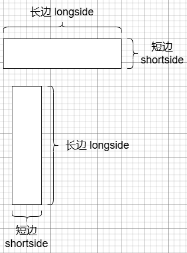
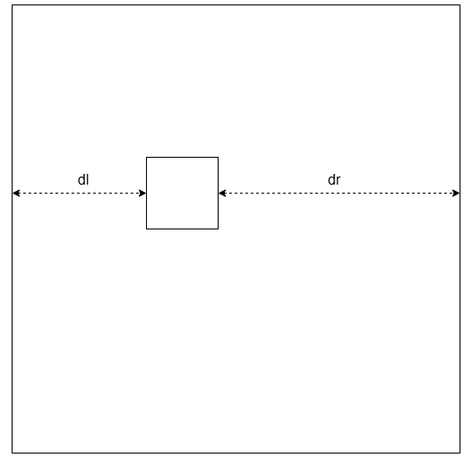

# infer_detector 设置

## 示例
```yaml
infer_detector:
  use: 1
  parameters:
    Class_A:
      confidence: [0.0, 1.0] # 置信度
      area: [0, 999999999] # 面积
      shortside: [0, 9999] # 短边
      longside: [0, 9999] # 长边
      dist2edge_x: [0.0, 1.0] # 水平方向到边缘的距离
      dist2edge_y: [0.0, 1.0] # 垂直方向到边缘的距离
    Class_B:
      confidence: [0.0, 1.0]
      area: [0, 999999999]
      shortside: [0, 9999]
      longside: [0, 9999]
      dist2edge_x: [0.0, 1.0]
      dist2edge_y: [0.0, 1.0]
```

## 用法

在yaml中加入 infer_detector node，如示例中的格式

如果你想对 Class_A 的检测进行限制，就将这种类别的字符串填写进 parameters node 中

```{important}
这里的字符串必须和infer_api返回的字符串完全一致，也就是说和训练时names中指定的名字一致，理论上也和返回的缺陷类型一致
```

可选限制项：
- confidence
- area
- shortside
- longside
- dist2edge_x
- dist2edge_y

以上限制项，每种限制项都用长度为 2 的数组描述，代表其 下界 和 上界

根据实际情况，将想要限制的项目加入到其中，不想限制的项目可以不填

### confidence 置信度

对output的置信度进行限制，只有置信度在范围以内的output才会被认作缺陷

### area 面积

对output的面积进行限制，分以下两种情况：

- 检测：用output中box的 宽 x 高，计算area
- 分割：调用cv::contourArea计算单个轮廓的面积，如果一个output有多个轮廓，将所有轮廓面积加到一起

同样，只有面积在范围内的output才会被认作缺陷

### shortside / longside 短边/长边



对output中的box的短边/长边进行限制

设预测返回的框 `box=[x,y,w,h]`  （左上角x坐标, 左上角y坐标, 宽度, 高度）

同样，只有在范围内的output才会被认作缺陷

### dist2edge_x / dist2edge_y

以水平方向为例:



设 dist2edge_x = [lb, ub]

```
dist = min(dl, dr)
if lb < dist < ub: 
  is defect
else: 
  filtered
```

垂直方向同理

## 注意事项

### 默认值

如果某个class的参数没有被定义，则其默认值为：

```
confidence: [0.0, 1.0]
area: [0, INT_MAX]
shortside: [0, INT_MAX]
longside: [0, INT_MAX]
```

如果某个class的参数被部分定义，比如只定义了confidence，则其他范围保持默认值

### 格式
- 注意缩进，不要使用tab，使用英文空格
- 不要使用中文冒号，逗号
- 所有的冒号、逗号后面应该有一个英文空格
- 不要出现空的Map，比如对Class_A你不想再加限制，应该将整个Class_A node注释掉或删掉